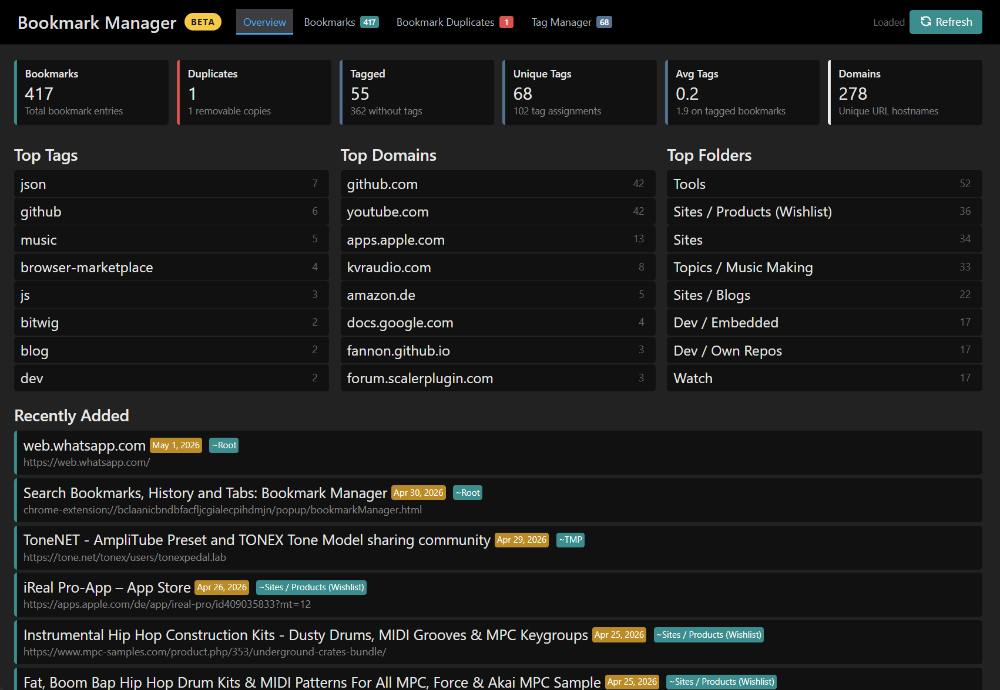
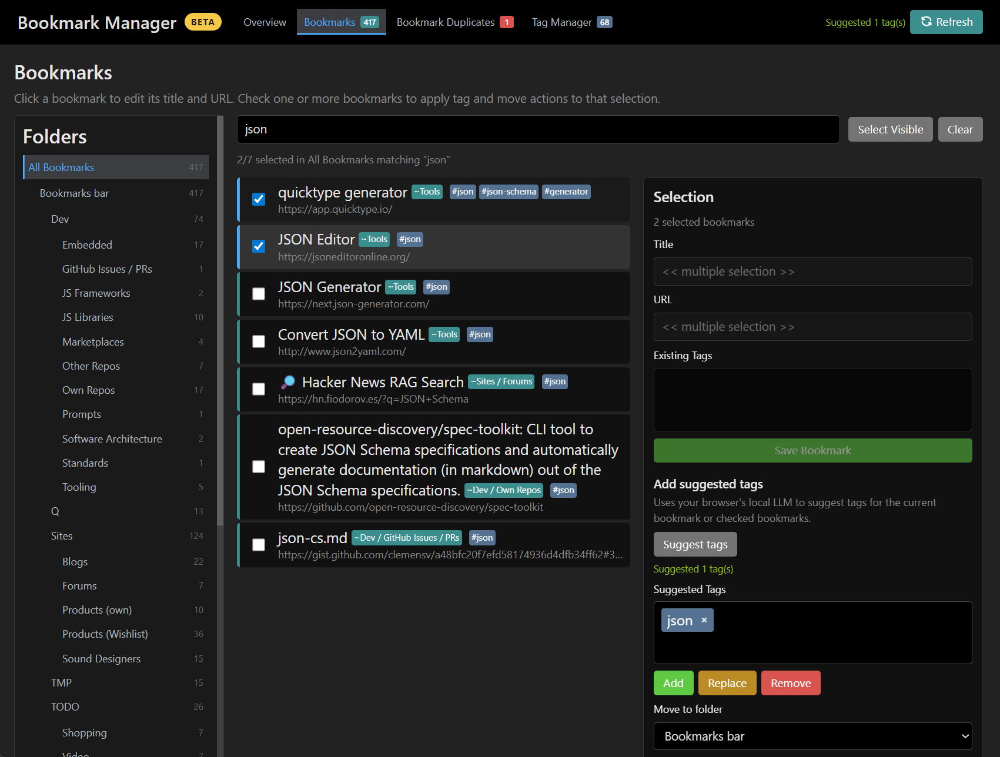
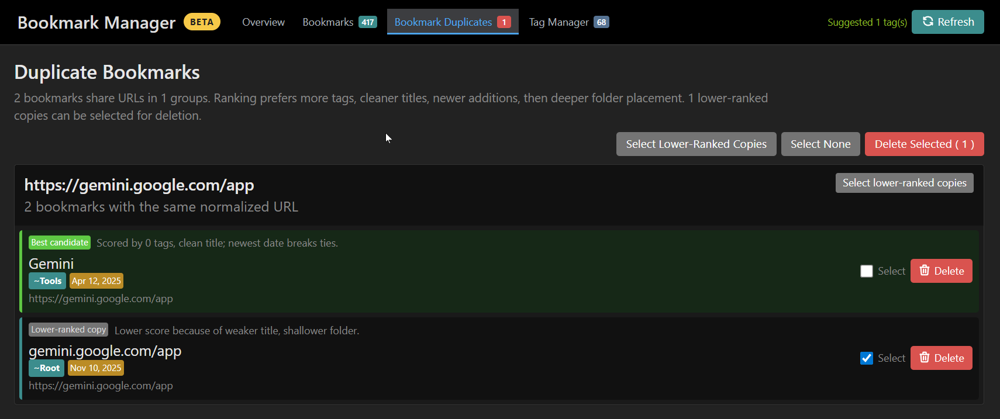
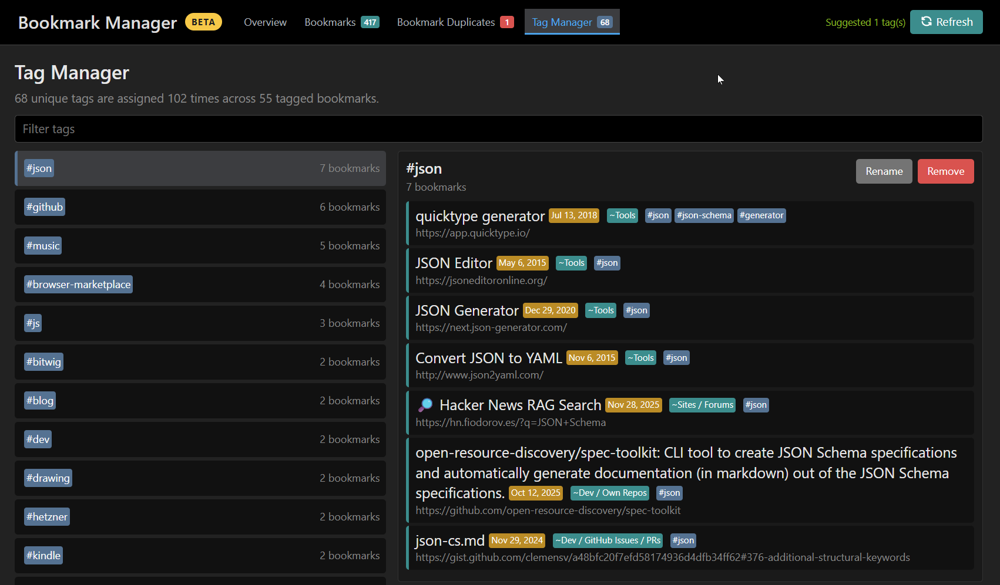

# Search Bookmarks, History and Browser Tabs

🔎 Browser extension to (fuzzy) search and navigate bookmarks, history and open tabs.

Available as [Chrome Extension](https://chrome.google.com/webstore/detail/tabs-bookmark-and-history/cofpegcepiccpobikjoddpmmocficdjj?hl=en-GB&authuser=0), [Microsoft Edge Addon](https://microsoftedge.microsoft.com/addons/detail/search-tabs-bookmarks-an/ldmbegkendnchhjppahaadhhakgfbfpo), [Firefox Addon](https://addons.mozilla.org/en-US/firefox/addon/search-tabs-bookmarks-history/) and [Opera Addon](https://addons.opera.com/en/extensions/details/search-bookmarks-history-and-tabs/) (only an old version).

## Quick Start

- Open the extension popup and type to search bookmarks, history, and open tabs.
- Press `Enter` to open the selected result, or right-click a result to copy its URL.
- Use prefixes to narrow the search: `b ` for bookmarks, `t ` for tabs, `h ` for history and tabs, `#tag`, `~folder`, or `@group`.
- Type `g search term` or `d word` to use the default custom search aliases.
- Click the edit icon on a bookmark result to edit its title, URL, tags, and favorite score.

## Features

**This extension does not collect any data nor does it make any external requests** (see [Privacy](#privacy--data-protection)).

It supports two different search approaches:

- **Precise search** (case-insensitive, but exact matching): Faster, but only exact matching results.
- **Fuzzy search** (approximate matching): Slower, but also includes inexact (fuzzy) matches.

With this extension you can also **tag your bookmarks** including auto completions.
The tags are considered when searching and can be used for navigation.
Tabs support now the tab grouping feature by the browser.

The extension is very customizable (see [user options](#user-configuration)) and has a dark / light theme that is selected based on your system settings (see [prefers-color-scheme](https://developer.mozilla.org/en-US/docs/Web/CSS/@media/prefers-color-scheme)). It's also very lightweight (< 120kb JavaScript, only ~30-40kb need to load initially - including dependencies).

> 💡 Have a look at the [Tips & Tricks](./Tips.md) collection.

> 🗎 For a list of recent changes, see [CHANGELOG.md](./CHANGELOG.md).

## Screenshots & Demo


Press play to start the GIF animation:


### Optional Bookmark Manager

The main purpose of this extension remains the fast search popup. As a complementary beta feature, there is also a full-page Bookmark Manager for reviewing bookmark statistics, browsing folders, cleaning up duplicate bookmark URLs, and managing tags. Where supported by the browser, it can suggest tags with a local (privacy respecting) browser AI model; suggestions are reviewed before they are written to bookmarks.

Before using the Bookmark Manager, creating a backup/export of your browser bookmarks is highly recommended, especially before moving bookmarks, changing tags in bulk, or deleting duplicates.

Click a screenshot to open it full size:

<table>
  <tr>
    <td width="50%">
      <a href="./images/manager/overview.png">
        
      </a>
    </td>
    <td width="50%">
      <a href="./images/manager/bookmark-manager.png">
        
      </a>
    </td>
  </tr>
  <tr>
    <td width="50%">
      <a href="./images/manager/bookmark-duplicates.png">
        
      </a>
    </td>
    <td width="50%">
      <a href="./images/manager/tag-manager.png">
        
      </a>
    </td>
  </tr>
</table>

## Browser Support

| Browser | Main extension | Tab groups | Website favicons |
| :--- | :--- | :--- | :--- |
| Chrome | Yes | Yes | Yes, with optional `favicon` permission |
| Edge | Yes | Yes | Yes, with optional `favicon` permission |
| Firefox | Yes | Graceful fallback if unavailable | Uses placeholder icons for bookmarks/history |
| Opera | Old version only | Depends on the installed version | Depends on the installed version |

## User Documentation

- **Search Strategies**: Switch between precise and fuzzy approach by clicking on the FUZZY or PRECISE button in the search bar (top right), or by pressing `Ctrl+F`.
- **Keyboard Shortcut**: Trigger the extension via keyboard.
  - The default is `CTRL` + `Shift` + `.`, but you can customize this (I personally use `Ctrl+J`).
- **Open selected results**: By default, the extension will open the selected result in a new active tab, or switch to an existing tab with the target URL.
  - Hold `Shift` or `Alt` to open the result in the current tab.
  - Hold `Ctrl` to open the result without closing the popup.
  - Right-click to copy URL to clipboard.
- **Search Modes**: In case you want to be more selective -> use a search mode:
  - Start your query with `#`: only **bookmarks with the tag** will be returned (exact "starts with" search)
    - Supports AND search, e.g. search for `#github #pr` to only get results which have both tags
    - Supports search within tags: Filter by tag and search for text simultaneously.
      - Usage: `#Tag` + **Double Space** + `SearchTerm` (e.g. `#dev  react`).
      - Tip: Press `TAB` to quickly insert the double-space separator.
  - Start your query with `~`: only **bookmarks within the folder** will be returned (exact "starts with" search)
    - Supports AND search, e.g. search for `~Sites ~Blogs` to only get results in both folders
    - Supports search within folders: Filter by folder and search for text simultaneously.
      - Usage: `~Folder` + **Double Space** + `SearchTerm` (e.g. `~Work  project`).
      - Tip: Press `TAB` to quickly insert the double-space separator.
  - Start your query with `@`: only **tabs in the named group** will be returned
    - Example: `@Work` to find all tabs in the "Work" tab group
    - Supports search within groups: Filter by group and search for text simultaneously.
      - Usage: `@Group` + **Double Space** + `SearchTerm` (e.g. `@Work  jira`).
      - Tip: Press `TAB` to quickly insert the double-space separator.
  - Start your query with `b ` (including space): only **bookmarks** will be searched.
  - Start your query with `h ` (including space): only **history** and **open tabs** will be searched.
  - Start your query with `t ` (including space): only **open tabs** will be searched.
  - Start your query with `s ` (including space): only **search engines** will be proposed.
  - Custom Aliases:
    - The option `customSearchEngines` allows you to define your own search mode aliases
    - Default: Start your query with `g ` (including space): Do a Google search.
    - Default: Start your query with `d ` (including space): Do a dict.cc search.
  - A search term that can be interpreted as URL (e.g. `example.com`) can be navigated to directly.
- **Emacs / Vim Navigation**:
  - `Ctrl+N` and `Ctrl+J` to navigate search results down
  - `Ctrl+K` and `Ctrl+P` to navigate search results up
- **Special Browser Pages**: You can add special browser pages to your bookmarks, like `chrome://downloads`.
- **Custom Scores**: Add custom bonus scores by putting ` +<whole number>` to your bookmark title (before tags)
  - Examples: `Bookmark Title +20` or `Another Bookmark +10 #tag1 #tag2`
- **Favorites**: In the bookmark editor, the FAVORITE button cycles between no favorite, yellow star (`+25`), orange star (`+50`), and red star (`+75`). Favorite scores use the same `+<number>` title format as custom scores.
- **Tags**:
  - A bookmark title cannot start with a tag, it needs a title
  - Tags cannot start with a number. This is how the extension filters out issue / ticket numbers.
- **Icons & Favicons**: This extension can display favicons or result type icons next to your search results.
  - To customize this, see `displayIcons` and `displayFavicons` in the [user configuration](#user-configuration) and [favicons in OPTIONS.md](./OPTIONS.md#website-favicons) for details on privacy, implementation, and browser support.
- This extension works best if you avoid:
  - using `#` in bookmark titles that do not indicate a tag.
  - using `~` in bookmark folder names.

## User Configuration

The extension is highly customizable.
Finding and setting options is a bit technical, though.

The user options are written in [YAML](https://en.wikipedia.org/wiki/YAML) or [JSON](https://en.wikipedia.org/wiki/JSON) notation.

> 📘 **See [OPTIONS.md](./OPTIONS.md) for a comprehensive list of all available options.**
>
> For advanced users, there is also a [JSON Schema](https://raw.githubusercontent.com/Fannon/search-bookmarks-history-and-tabs/main/popup/json/options.schema.json) available.
>
> You can also browse the source in [options.js](https://github.com/Fannon/search-bookmarks-history-and-tabs/blob/main/popup/js/model/options.js) for inline documentation.

When defining your custom config, you only need to define the options that you want to overwrite from the defaults.
The extension will validate your input against the JSON schema before saving.

An exemplary user config can look like the following example:

```yaml
searchStrategy: fuzzy
displayVisitCounter: true
historyMaxItems: 2048 # Increase max number of browser history items to load
maxRecentTabsToShow: 32 # Limit number of recent tabs shown (default: 8)
```

If you have **troubles with performance**, here are a few options that might help. Feel free to pick & choose and tune the values to your situation. In particular `historyMaxItems` and how many bookmarks you have will impact init and search performance.

Here is a suggestion for low-performance machines:

```yaml
searchStrategy: precise # Precise search is faster than fuzzy search.
displaySearchMatchHighlight: false # Not highlighting search matches improves render performance.
searchMaxResults: 20 # Number of search results can be further limited
historyMaxItems: 512 # Number of browser history items can be further reduced
maxRecentTabsToShow: 4 # Reduce number of recent tabs for better performance
detectDuplicateBookmarks: false # Disable duplicate detection for faster startup (if you don't have duplicates)
```

Or a more advanced example:

```yaml
searchStrategy: precise
historyDaysAgo: 14
historyMaxItems: 2048
historyIgnoreList:
  - extension://
  - http://localhost
  - http://127.0.0.1
scoreTabBase: 70 # customize base score for open tabs
detectDuplicateBookmarks: true
maxRecentTabsToShow: 4
searchEngineChoices:
  - name: Google
    urlPrefix: https://google.com/search?q=
customSearchEngines:
  - alias: ['g', 'google']
    name: Google
    urlPrefix: https://www.google.com/search?q=$s
    blank: https://www.google.com
  - alias: d
    name: dict.cc
    urlPrefix: https://www.dict.cc/?s=$s
  - alias: [gh, github]
    name: GitHub
    urlPrefix: https://github.com/search?q=$s
    blank: https://github.com
  - alias: npm
    name: NPM
    urlPrefix: https://www.npmjs.com/search?q=$s
    blank: https://www.npmjs.com
```

In case of making multilingual search (CJK) correctly, you may need to tweak [uFuzzy](https://github.com/leeoniya/uFuzzy) options via option `uFuzzyOptions`, for example:

```yaml
# make CJK chars work for fuzzy search
uFuzzyOptions:
  interSplit: (p{Unified_Ideograph=yes})+
```

## Scoring System

Results are ranked by a relevance score. Each result starts with a base score by type, then search quality, exact-match bonuses, usage signals, open-tab state, and optional custom bookmark bonuses can adjust the final order. Bookmarks can also be boosted with `+<number>` in the title or via the bookmark editor's FAVORITE button.

For the full scoring reference and all scoring configuration options, see:
- **[scoring.js](https://github.com/Fannon/search-bookmarks-history-and-tabs/blob/main/popup/js/search/scoring.js)** — Core scoring algorithm with comprehensive documentation
- **[OPTIONS.md](https://github.com/Fannon/search-bookmarks-history-and-tabs/blob/main/OPTIONS.md)** — Complete list of scoring configuration options

## Privacy / Data Protection

This extension is built to respect your privacy:

- It does not have permissions for outside communication, so none of your data is shared or exposed externally.
- Local AI tag suggestions in the optional Bookmark Manager use the browser's local `LanguageModel` API when available; selected bookmark metadata is sent only to that browser-managed local model.
- It does not use external favicon services. Website favicons are read from browser-local APIs or caches where supported.
- The extension does not even store any information except your user settings.
  Every time the extension popup is closed, it "forgets" everything and starts from a blank slate next time you open it.
- There is no background job / processing. If the popup is not explicitly opened by the user, the extension is not executed.
- The extension only requests the following permissions for the given reasons:
  - **bookmarks**: Necessary to read and edit the bookmarks. Can be disabled via [user configuration](#user-configuration).
  - **history**: Necessary to read the browsing history. Can be disabled or limited via [user configuration](#user-configuration).
  - **tabs**: Necessary to find open tabs and to use tabs for navigation. Can be disabled via [user configuration](#user-configuration).
  - **storage**: Necessary to store and retrieve the [user configuration](#user-configuration).
    If the browser has setting synchronization enabled, the extension settings will be synced (in this case you already trust your browser to sync everything else anyway).
    If browser sync is disabled, the user configuration is only stored locally.
  - **tabGroups**: Necessary to read tab group names for the tab group search feature. The feature degrades gracefully if unavailable.
  - **favicon**: Optional permission, but needed if `displayFavicons` is enabled: Used for Chrome's native favicon API to retrieve icons for bookmarks and history. This only accesses local data.
- The extension is open source, so feel free to convince yourself :)

### Privacy FAQ

- **Does the extension send my bookmarks, history, tabs, or searches anywhere?** No. The extension has no network or telemetry code.
- **What is stored?** Only your user options are stored. Bookmark edits are saved through the browser's bookmark API because they intentionally change your browser bookmarks.
- **Why does it need bookmark, history, and tab permissions?** Those permissions are required to search and navigate those browser data sources. You can disable bookmarks, history, or tabs in the user configuration if you do not want a source included.
- **Why is `favicon` optional?** The permission is only requested if you enable `displayFavicons: true`.

## Local Development

Local development setup, project structure, and workflows are documented in [CONTRIBUTING.md#local-development](./CONTRIBUTING.md#local-development).

## Credits

This extension makes use of the following helpful open-source projects (thanks!):

- https://github.com/leeoniya/uFuzzy for the fuzzy search algorithm
- https://github.com/yairEO/tagify for the tag autocomplete widget
- https://www.npmjs.com/package/js-yaml for the user options parsing
- https://github.com/tabler/tabler-icons for icons
- https://www.joshwcomeau.com/css/custom-css-reset/

## Feedback and Ideas

> Please create a [GitHub issue](https://github.com/Fannon/search-bookmarks-history-and-tabs/issues) to give your feedback.
> All ideas, suggestions or bug reports are welcome.
