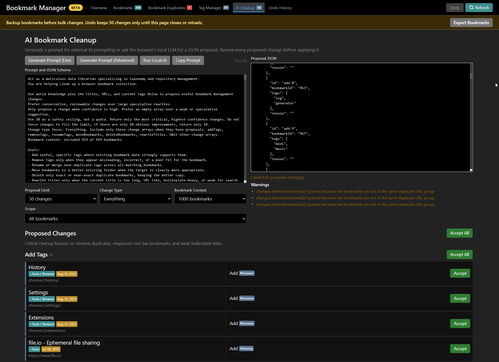
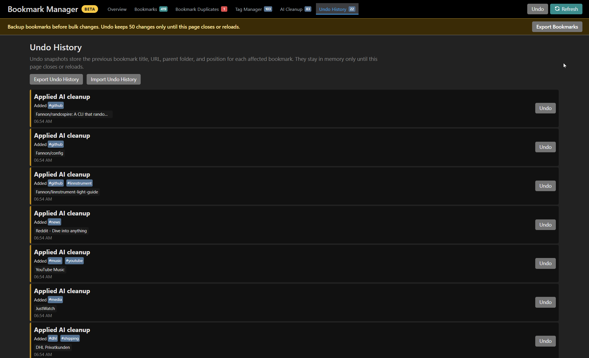

# Поиск закладок, истории и вкладок браузера

> **Язык / Language:** [English](../../README.md) | **Русский**
> *   **Документация / Documentation:** [OPTIONS.md](../../OPTIONS.md) | [OPTIONS.ru.md](./OPTIONS.md)

🔎 Расширение для браузера для (нечеткого) поиска и навигации по закладкам, истории и открытым вкладкам.

Доступно в виде [расширения Chrome](https://chrome.google.com/webstore/detail/tabs-bookmark-and-history/cofpegcepiccpobikjoddpmmocficdjj?hl=en-GB&authuser=0), [надстройки Microsoft Edge](https://microsoftedge.microsoft.com/addons/detail/search-tabs-bookmarks-an/ldmbegkendnchhjppahaadhhakgfbfpo), [дополнения Firefox](https://addons.mozilla.org/en-US/firefox/addon/search-tabs-bookmarks-history/) and [дополнения Opera](https://addons.opera.com/en/extensions/details/search-bookmarks-history-and-tabs/) (только старая версия).

## Быстрый старт

- Откройте всплывающее окно расширения и введите текст для поиска по закладкам, истории и открытым вкладкам.
- Нажмите `Enter`, чтобы открыть выбранный результат, или щелкните правой кнопкой мыши по результату, чтобы скопировать его URL-адрес.
- Используйте префиксы для сужения поиска: `b ` для закладок, `t ` для вкладок, `h ` для истории и вкладок, `#тег`, `~папка` или `@группа`.
- Введите `g поисковый запрос` или `d слово` для использования пользовательских псевдонимов поиска по умолчанию.
- Нажмите на значок редактирования у результата закладки, чтобы изменить её название, URL-адрес, теги и оценку «избранного».

## Возможности

**Это расширение не собирает никаких данных и не выполняет никаких внешних запросов** (см. раздел [Конфиденциальность](#конфиденциальность-и-защита-данных)).

Оно поддерживает два различных подхода к поиску:

- **Точный поиск** (без учета регистра, но с точным совпадением): более быстрый, но возвращает только точные совпадения.
- **Нечеткий поиск** (приблизительное соответствие): более медленный, но включает также неточные (нечеткие) совпадения.

С помощью этого расширения вы также можете **добавлять теги к своим закладкам**, включая автозаполнение.
Теги учитываются при поиске и могут использоваться для навигации.
Вкладки теперь поддерживают функцию группировки вкладок браузера.

Расширение очень гибко настраивается (см. [настройки пользователя](#настройки-пользователя)) и имеет темную/светлую тему, которая выбирается на основе системных настроек вашей ОС (см. [prefers-color-scheme](https://developer.mozilla.org/en-US/docs/Web/CSS/@media/prefers-color-scheme)). Всплывающее окно для ежедневного поиска остается легковесным: изначально загружается около 33 КБ минимизированного JavaScript-кода приложения, а дополнительные функции, такие как нечеткий поиск и полностраничный Диспетчер закладок, поставляются в отдельных пакетах (бандлах).

> 💡 Обратите внимание на коллекцию [Советов и хитростей](./Tips.md).

> 🗎 Список недавних изменений см. в файле [CHANGELOG.md](./CHANGELOG.md).

## Скриншоты и демонстрация


Нажмите кнопку воспроизведения, чтобы запустить GIF-анимацию:


### Дополнительный диспетчер закладок (бета)

Основной задачей этого расширения остается всплывающее окно быстрого поиска. В качестве дополнительной **бета-функции** также доступен полностраничный Диспетчер закладок для просмотра статистики закладок, просмотра папок, редактирования метаданных закладок, очистки дубликатов URL-адресов закладок и управления тегами. Там, где это поддерживается браузером, он может предлагать теги с помощью локальной (уважающей конфиденциальность) модели ИИ браузера; предложения проверяются перед записью в закладки.

Диспетчер закладок также включает бета-версию рабочей среды «ИИ-очистка» (AI Cleanup). Она может генерировать простые (Lite) или расширенные (Advanced) промпты для внешних инструментов ИИ, либо запрашивать у локального API `LanguageModel` браузера предложение по очистке в формате JSON. Предложения можно просмотреть перед применением любых изменений, и они могут включать добавление/удаление/переименование тегов, перезапись названий, перемещение в существующие папки и подтвержденное удаление дубликатов.

Перед использованием Диспетчера закладок настоятельно рекомендуется создать резервную копию или выполнить экспорт ваших закладок браузера, особенно перед перемещением закладок, массовым изменением тегов или удалением дубликатов.
Диспетчер может экспортировать ваши закладки в стандартном формате HTML-закладок браузера. Он также хранит в памяти до 50 последних шагов отмены, пока страница диспетчера открыта, но отмена в памяти не заменяет полноценный экспорт закладок.

Нажмите на скриншот, чтобы открыть его в полном размере:

<table>
  <tr>
    <td width="50%">
      <a href="../../images/manager/overview.png">
        
      </a>
    </td>
    <td width="50%">
      <a href="../../images/manager/bookmark-manager.png">
        
      </a>
    </td>
  </tr>
  <tr>
    <td width="50%">
      <a href="../../images/manager/bookmark-duplicates.png">
        
      </a>
    </td>
    <td width="50%">
      <a href="../../images/manager/tag-manager.png">
        
      </a>
    </td>
  </tr>
  <tr>
    <td width="50%">
      <a href="../../images/manager/ai-cleanup.png">
        
      </a>
    </td>
    <td width="50%">
      <a href="../../images/manager/undo-history.png">
        
      </a>
    </td>
  </tr>
</table>

## Поддержка браузерами

| Браузер | Основное расширение | Группы вкладок | Фавиконы сайтов |
| :--- | :--- | :--- | :--- |
| Chrome | Да | Да | Да, с дополнительным разрешением `favicon` |
| Edge | Да | Да | Да, с дополнительным разрешением `favicon` |
| Firefox | Да | Успешный откат, если недоступно | Только иконки открытых вкладок, где это возможно |
| Opera | Только старая версия | Зависит от установленной версии | Зависит от установленной версии |

## Документация пользователя

- **Стратегии поиска**: переключайтесь между точным и нечетким подходом, нажимая кнопку FUZZY или PRECISE на панели поиска (справа вверху) либо нажимая `Ctrl+F`.
- **Горячие клавиши**: вызывайте расширение с помощью клавиатуры.
  - По умолчанию используется `CTRL` + `Shift` + `.`, но вы можете настроить это сочетание клавиш (автор лично использует `Ctrl+J`).
- **Открытие выбранных результатов**: по умолчанию расширение открывает выбранный результат в новой активной вкладке или переключается на уже существующую вкладку с целевым URL.
  - Удерживайте `Shift` или `Alt`, чтобы открыть результат в текущей вкладке.
  - Нажмите `Ctrl+Enter`, чтобы открыть результат, не закрывая всплывающее окно.
  - Нажмите `F2`, чтобы отредактировать выбранную закладку или создать новую из выбранного URL-адреса.
  - Щелкните правой кнопкой мыши, чтобы скопировать URL-адрес в буфер обмена.
  - Предпочитаете открывать в текущей вкладке по умолчанию? Включите опцию `openInCurrentTab`; в этом случае зажатые клавиши `Shift`/`Alt` будут открывать результат в новой вкладке.
- **Режимы поиска**: если вы хотите искать выборочно, используйте режимы поиска:
  - Начните запрос с `#`: будут возвращены только **закладки с этим тегом** (точный поиск «начинается с»)
    - Поддерживается поиск И (AND), например, поиск по запросу `#github #pr` вернет только результаты, содержащие оба тега.
    - Поддерживается поиск внутри тегов: фильтрация по тегу и поиск текста одновременно.
      - Использование: `#Тег` + **Двойной пробел** + `ПоисковыйЗапрос` (например, `#dev  react`).
      - Совет: Нажмите `TAB`, чтобы быстро вставить разделитель из двойного пробела.
  - Начните запрос с `~`: будут возвращены только **закладки внутри этой папки** (точный поиск «начинается с»)
    - Поддерживается поиск И (AND), например, поиск по запросу `~Sites ~Blogs` вернет только результаты, находящиеся в обеих папках.
    - Поддерживается поиск внутри папок: фильтрация по папке и поиск текста одновременно.
      - Использование: `~Папка` + **Двойной пробел** + `ПоисковыйЗапрос` (например, `~Work  project`).
      - Совет: Нажмите `TAB`, чтобы быстро вставить разделитель из двойного пробела.
  - Начните запрос с `@`: будут возвращены только **вкладки в указанной группе**
    - Пример: `@Work` для поиска всех вкладок в группе «Work»
    - Поддерживается поиск внутри групп: фильтрация по группе и поиск текста одновременно.
      - Использование: `@Группа` + **Двойной пробел** + `ПоисковыйЗапрос` (например, `@Work  jira`).
      - Совет: Нажмите `TAB`, чтобы быстро вставить разделитель из двойного пробела.
  - Начните запрос с `b ` (включая пробел): поиск будет выполняться только по **закладкам**.
  - Начните запрос с `h ` (включая пробел): поиск будет выполняться только по **истории** и **открытым вкладкам**.
  - Начните запрос с `t ` (включая пробел): поиск будет выполняться только по **открытым вкладкам**.
  - Начните запрос с `s ` (включая пробел): будут предлагаться только **поисковые системы**.
  - Пользовательские псевдонимы (Custom Aliases):
    - Опция `customSearchEngines` позволяет вам определять собственные псевдонимы режимов поиска.
    - По умолчанию: начните запрос с `g ` (включая пробел): выполнить поиск в Google.
    - По умолчанию: начните запрос с `d ` (включая пробел): выполнить поиск в словаре dict.cc.
  - Поисковый запрос, который может быть интерпретирован как URL-адрес (например, `example.com`), можно открыть напрямую.
- **Навигация в стиле Emacs / Vim**:
  - `Ctrl+N` и `Ctrl+J` для перемещения по результатам поиска вниз.
  - `Ctrl+K` и `Ctrl+P` для перемещения по результатам поиска вверх.
- **Специальные страницы браузера**: вы можете добавлять в свои закладки специальные страницы браузера, такие как `chrome://downloads`.
- **Пользовательские оценки (Custom Scores)**: добавляйте к названию вашей закладки (перед тегами) ` +<целое число>` для начисления бонусных баллов рейтинга.
  - Примеры: `Название Закладки +20` или `Другая Закладка +10 #тег1 #тег2`
- **Избранное (Favorites)**: в редакторе закладок кнопка FAVORITE переключает состояния: не избранное, желтая звезда (`+25`), оранжевая звезда (`+50`) и красная звезда (`+75`). Оценки избранного используют тот же формат названия ` +<число>`, что и пользовательские оценки.
- **Теги**:
  - Название закладки не может начинаться с тега, ей необходимо название.
  - Теги не могут начинаться с цифры. Таким образом расширение отфильтровывает номера задач/тикетов.
- **Фавиконы**: это расширение может отображать фавиконы сайтов рядом с результатами поиска.
  - Информацию по настройке см. в описании параметра `displayFavicons` в разделе [настройки пользователя](#настройки-пользователя), а подробности о конфиденциальности, реализации и поддержке браузерами — в файле [OPTIONS.md на английском языке](./OPTIONS.md#website-favicons).
- Это расширение работает лучше всего, если вы избегаете:
  - использования символа `#` в названиях закладок, если он не обозначает тег;
  - использования символа `~` в названиях папок закладок.

## Настройки пользователя

Расширение очень гибко настраивается.
Откройте полностраничный Диспетчер закладок и перейдите во вкладку **Options** для редактирования настроек.
Слева находится форма на основе схемы с интерактивными описаниями и валидацией, а справа — синхронизированный редактор YAML для продвинутого редактирования.

Пользовательские настройки записываются в формате [YAML](https://ru.wikipedia.org/wiki/YAML) или [JSON](https://ru.wikipedia.org/wiki/JSON).

> 📘 **Полный список всех доступных опций см. в файле [OPTIONS.md на английском языке](./OPTIONS.md).**
>
> Для продвинутых пользователей также доступна [схема JSON](https://raw.githubusercontent.com/Fannon/search-bookmarks-history-and-tabs/main/popup/json/options.schema.json).
>
> Вы также можете изучить исходный код в файле [options.js](https://github.com/Fannon/search-bookmarks-history-and-tabs/blob/main/popup/js/model/options.js) для ознакомления со встроенной документацией.

При определении собственной конфигурации вам нужно указывать только те параметры, которые вы хотите переопределить по сравнению с настройками по умолчанию.
В форме невыбранные настройки не сохраняются и продолжают использовать значения по умолчанию.
Перед сохранением расширение проверит ваш ввод на соответствие схеме JSON.

Пример пользовательской конфигурации может выглядеть следующим образом:

```yaml
searchStrategy: fuzzy
displayVisitCounter: true
historyMaxItems: 2048 # Увеличить максимальное количество загружаемых элементов истории браузера
maxRecentTabsToShow: 32 # Ограничить количество отображаемых последних вкладок (по умолчанию: 8)
```

Если у вас возникли **проблемы с производительностью**, вот несколько вариантов, которые могут помочь. Вы можете выбрать наиболее подходящие параметры в зависимости от ситуации. В частности, `historyMaxItems` и общее количество закладок существенно влияют на производительность инициализации и поиска.

Рекомендации для маломощных устройств:

```yaml
searchStrategy: precise # Точный поиск работает быстрее, чем нечеткий.
displaySearchMatchHighlight: false # Отключение подсветки совпадений улучшает производительность рендеринга.
searchMaxResults: 20 # Можно дополнительно ограничить количество результатов поиска
historyMaxItems: 512 # Можно дополнительно уменьшить количество элементов истории браузера
maxRecentTabsToShow: 4 # Уменьшение количества последних вкладок для повышения производительности
```

Более сложный пример настройки:

```yaml
searchStrategy: precise
historyDaysAgo: 14
historyMaxItems: 2048
historyIgnoreList:
  - extension://
  - http://localhost
  - http://127.0.0.1
scoreTabBase: 70 # Настроить базовую оценку для открытых вкладок
maxRecentTabsToShow: 4
searchEngineChoices:
  - name: Google
    urlPrefix: https://google.com/search?q=
customSearchEngines:
  - alias: ['g', 'google']
    name: Google
    urlPrefix: https://www.google.com/search?q=$s
    blank: https://www.google.com
  - alias: d
    name: dict.cc
    urlPrefix: https://www.dict.cc/?s=$s
  - alias: [gh, github]
    name: GitHub
    urlPrefix: https://github.com/search?q=$s
    blank: https://github.com
  - alias: npm
    name: NPM
    urlPrefix: https://www.npmjs.com/search?q=$s
    blank: https://www.npmjs.com
```

Для корректной работы многоязычного поиска (CJK — китайский, японский, корейский) может потребоваться настроить параметры [uFuzzy](https://github.com/leeoniya/uFuzzy) через опцию `uFuzzyOptions`, например:

```yaml
# заставить символы CJK работать в нечетком поиске
uFuzzyOptions:
  interSplit: (p{Unified_Ideograph=yes})+
```

## Система оценки (Scoring System)

Результаты сортируются по оценке соответствия (релевантности). Каждый результат начинается с базовой оценки по типу, затем финальный порядок корректируется с учетом качества поиска, бонусов за точное совпадение, сигналов использования, состояния открытых вкладок и дополнительных бонусов для избранных закладок. Рейтинг закладок также можно повысить с помощью приписки `+<число>` в названии или с помощью кнопки FAVORITE в редакторе закладок.

Для ознакомления со всеми правилами ранжирования и опциями конфигурации оценок см.:
- **[scoring.js](https://github.com/Fannon/search-bookmarks-history-and-tabs/blob/main/popup/js/search/scoring.js) (на английском языке)** — Основной алгоритм ранжирования с подробным описанием
- **[OPTIONS.md](https://github.com/Fannon/search-bookmarks-history-and-tabs/blob/main/OPTIONS.md) (на английском языке)** — Полный список опций конфигурации оценок

## Конфиденциальность и защита данных

Это расширение разработано с уважением к вашей конфиденциальности:

- Оно не имеет разрешений на внешние сетевые подключения, поэтому ваши данные никуда не отправляются и не передаются вовне.
- Локальные предложения тегов ИИ и локальные предложения по очистке ИИ в дополнительном Диспетчере закладок используют локальный API `LanguageModel` браузера, если он доступен; выбранные или включенные метаданные закладок передаются только этой локальной модели под управлением браузера.
- Если вы копируете сгенерированный промпт ИИ-очистки во внешний инструмент ИИ, вы сами соглашаетесь поделиться метаданными закладки с этим сервисом.
- Оно не использует внешние сервисы фавиконов. Фавиконы сайтов считываются из локальных API браузера или кэша, если это поддерживается.
- Расширение использует [локальное хранилище (localStorage)](https://developer.mozilla.org/ru/docs/Web/API/Window/localStorage) для сохранения пользовательских настроек.
  История отмены Диспетчера закладок хранится в памяти только во время работы страницы диспетчера.
  Каждый раз при закрытии всплывающего окна поиска оно «забывает» данные поиска и запускается с чистого листа при следующем открытии.
  - Нет фоновых процессов или задач. Если всплывающее окно не открыто пользователем явно, расширение не выполняется.
- Расширение запрашивает только следующие разрешения по указанным причинам:
  - **bookmarks**: необходимо для чтения и редактирования закладок. Может быть отключено в [настройках пользователя](#настройки-пользователя).
  - **history**: необходимо для чтения истории посещений. Может быть отключено или ограничено в [настройках пользователя](#настройки-пользователя).
  - **tabs**: необходимо для поиска открытых вкладок и навигации по ним. Может быть отключено в [настройках пользователя](#настройки-пользователя).
  - **storage**: необходимо для сохранения и загрузки [настроек пользователя](#настройки-пользователя).
    Если в браузере включена синхронизация настроек, параметры расширения будут синхронизироваться (в этом случае вы уже доверяете своему браузеру синхронизацию остальных данных). Если синхронизация отключена, настройки хранятся только локально.
  - **tabGroups**: необходимо для чтения названий групп вкладок для функции поиска по группам вкладок. Функция корректно отключается при недоступности разрешения.
  - **favicon**: дополнительное разрешение, необходимое при включении `displayFavicons`: используется для нативного API фавиконов Chrome для получения значков закладок и истории. Обращается только к локальным данным.
- Расширение имеет открытый исходный код, так что вы можете лично во всем убедиться :)

### Часто задаваемые вопросы о конфиденциальности

- **Отправляет ли расширение мои закладки, историю, вкладки или поисковые запросы куда-либо?** Нет. В коде расширения отсутствуют сетевые запросы и телеметрия.
- **Что сохраняется?** Сохраняются настройки пользователя. История отмены в Диспетчере закладок хранится только в оперативной памяти и исчезает при закрытии или перезагрузке страницы диспетчера. Изменения закладок сохраняются через API закладок браузера, так как они намеренно меняют закладки вашего браузера.
- **Почему требуются разрешения на закладки, историю и вкладки?** Эти разрешения необходимы для поиска и навигации по соответствующим источникам данных браузера. Вы можете отключить любой из источников в настройках пользователя, если не хотите, чтобы он участвовал в поиске.
- **Почему разрешение `favicon` является необязательным?** Запрос на получение этого разрешения отправляется только в том случае, если вы включите параметр `displayFavicons: true`.

## Локальная разработка

Настройка локальной среды разработки, структура проекта и рабочие процессы описаны в файле [CONTRIBUTING.md#local-development (на английском языке)](./CONTRIBUTING.md#local-development).

## Благодарности

В этом расширении используются следующие полезные проекты с открытым исходным кодом (спасибо их авторам!):

- https://github.com/leeoniya/uFuzzy — для алгоритма нечеткого поиска
- https://github.com/yairEO/tagify — для виджета автозаполнения тегов
- https://www.npmjs.com/package/js-yaml — для парсинга пользовательских настроек
- https://github.com/tabler/tabler-icons — для иконок
- https://www.joshwcomeau.com/css/custom-css-reset/

## Обратная связь и идеи

> Пожалуйста, создайте [обращение на GitHub (GitHub issue)](https://github.com/Fannon/search-bookmarks-history-and-tabs/issues), чтобы поделиться своим мнением.
> Приветствуются любые идеи, предложения и сообщения об ошибках.
